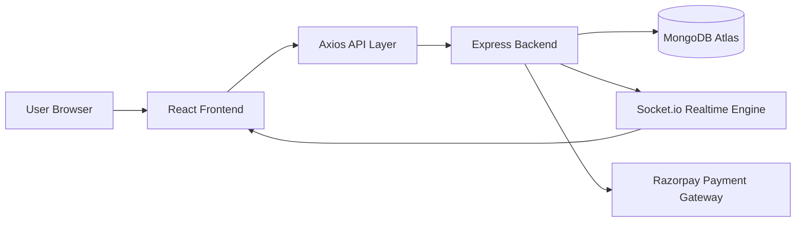
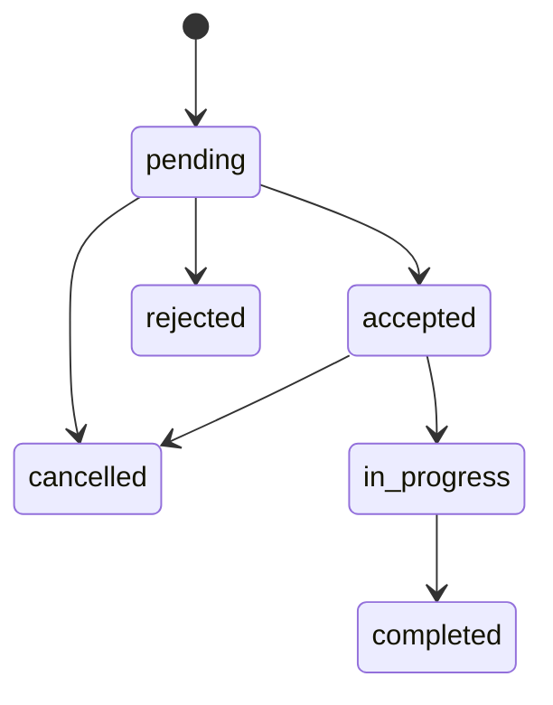
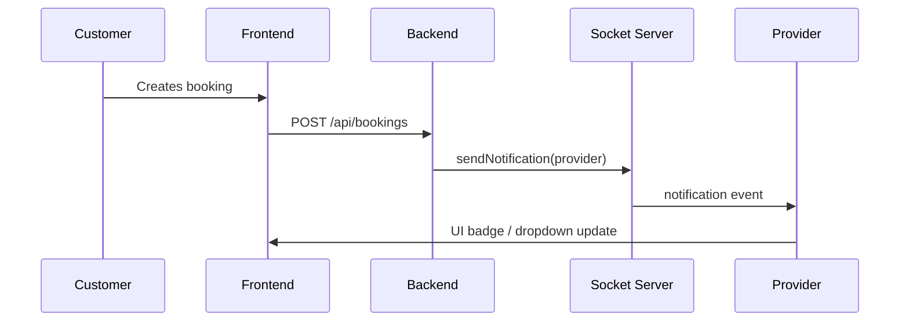
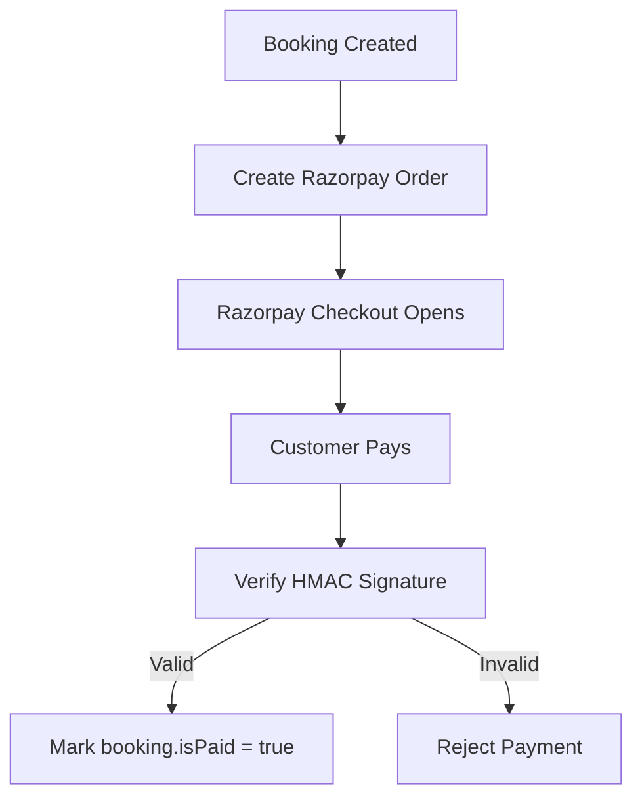
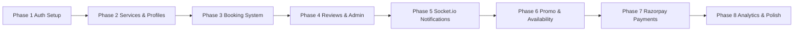

# ServiceConnect — Local Service Booking Platform

ServiceConnect ek full-stack local service booking platform hai jo customers ko nearby services discover karne, compare karne, book karne, review karne aur track karne ka structured way deta hai. Is project ka core purpose sirf ek booking app banana nahi hai, balki ek real-world marketplace flow create karna hai jahan customer, provider, aur admin tino roles ko clear business rules ke through connect kiya gaya ho. Ye project resume-level polish ke saath design kiya gaya hai taaki internship ya junior full-stack role ke liye strong portfolio piece ban sake. The app is planned as a production-minded system with authentication, role-based access control, provider verification, service discovery, booking lifecycle management, reviews, notifications, promo codes, payments, and analytics. The entire flow is built around practical software engineering patterns and scalable architecture choices, as described in the project prompt. fileciteturn0file0

---

## 1) Project Overview

ServiceConnect ek **local services marketplace** hai jahan users apni daily aur professional needs ke liye trusted providers dhoondh sakte hain. Example ke liye electrician, plumber, tutor, AC repair, cleaner, ya kisi bhi other service ko platform par list kiya ja sakta hai. Customer browse karega, service compare karega, provider profile dekhega, booking karega, real-time updates receive karega, payment complete karega, aur baad mein review dega. Provider apni services, availability, bookings, aur earnings manage karega. Admin platform ko supervise karega, providers verify karega, users block/unblock karega, aur analytics dashboard ke through platform health monitor karega.

Is project ka structure intentionally modular rakha gaya hai. Frontend React + Vite par based hai, backend Node.js + Express par, database MongoDB + Mongoose ke through managed hai, aur realtime communication Socket.io se supported hai. Authentication JWT ke through hoti hai. UI ke andar Tailwind CSS use hota hai taaki fast, modern, aur maintainable interface mile. Payments ke liye Razorpay planned hai. Final version mein analytics ke liye Recharts aur advanced dashboards bhi include kiye gaye hain. Ye combination ek aisa stack banata hai jo industry-friendly bhi hai aur interview-friendly bhi. fileciteturn0file0

---

## 2) Problem Statement

Local service booking ka market bahut fragmented hota hai. Users ko ya to WhatsApp calls, phone numbers, ya random listings ke through services search karni padti hain. Trusted provider dhoondhna, availability check karna, pricing compare karna, booking confirm karna, aur status follow karna kaafi messy process hota hai. Ek common issue ye bhi hota hai ki customer aur provider ke beech communication scattered hoti hai, jiski wajah se missed appointments, delayed responses, aur trust issues create hote hain.

ServiceConnect in problems ko address karta hai by converting unstructured offline service interaction ko ek structured digital marketplace experience mein. User ko role-based UI milta hai, provider verification available hoti hai, bookings ka status machine-defined hota hai, reviews ke through credibility build hoti hai, aur admin controls platform safety maintain karte hain. Essentially, project ka goal ye hai ki local services ko ek modern product experience diya jaye jahan discovery, booking, fulfillment, payment, aur feedback sab ek hi system mein ho. fileciteturn0file0

---

## 3) Goals of the Platform

ServiceConnect ko design karte waqt kuch core goals follow kiye gaye:

| Goal | Description |
|---|---|
| Clear role separation | Customer, Provider, aur Admin ke liye different permissions aur dashboards |
| Smooth service discovery | Search, filtering, categories, rating, aur price based browsing |
| Trust and verification | Provider verification, reviews, blocked users, and ratings |
| Controlled booking lifecycle | Pending se complete tak valid status transitions |
| Real-time communication | Socket.io based notifications for booking updates |
| Revenue and analytics | Earnings, monthly trends, status counts, and provider performance |
| Payment readiness | Razorpay integration for secure online payments |
| Resume quality | Clean architecture, reusable components, and production-style code patterns |

Ye goals project ko sirf demo app se zyada banate hain. Isse ek practical SaaS-style marketplace feel milta hai jahan each module business value deliver karta hai. fileciteturn0file0

---

## 4) Solution Approach

ServiceConnect ka solution approach layered architecture aur role-driven workflows par based hai. Sabse pehle user identity establish hoti hai via JWT authentication. Phir role ke according access grant hota hai. Customer browse aur booking kar sakta hai, provider services aur bookings manage kar sakta hai, aur admin platform-level decisions le sakta hai.

Solution ko multiple phases mein design kiya gaya hai taaki implementation structured rahe. Phase 1 mein auth foundation, Phase 2 mein service discovery, Phase 3 mein booking engine, Phase 4 mein review/admin tools, Phase 5 mein realtime notifications, Phase 6 mein promo/availability, Phase 7 mein payments, aur Phase 8 mein analytics polish add ki jati hai. Ye phased execution approach development ko manageable rakhta hai, bugs ko isolate karta hai, aur har milestone ko independently testable banata hai. The prompt explicitly emphasizes eight phases and complete, copy-paste-ready files for each step. fileciteturn0file0

---

## 5) Key Features

| Feature | Customer | Provider | Admin |
|---|---:|---:|---:|
| Register / Login | Yes | Yes | Yes |
| Browse services | Yes | Yes | Yes |
| Search and filters | Yes | Yes | Yes |
| Provider profile | Yes | Yes | Yes |
| Create service | No | Yes | No |
| Booking management | Yes | Yes | Yes |
| Status updates | No | Yes | No |
| Reviews | Yes | Yes | View only |
| Verification | No | No | Yes |
| User blocking | No | No | Yes |
| Notifications | Yes | Yes | Yes |
| Promo codes | Yes | No | Yes |
| Payments | Yes | Yes | View only |
| Analytics | No | Yes | Yes |

Ye table dikhata hai ki platform ka access model intentionally role-aware hai. Har user ko wahi tools milte hain jo us role ke liye relevant hain. Isse UI clutter kam hota hai aur security boundaries strong hoti hain. fileciteturn0file0

---

## 6) Tech Stack

| Layer | Technology | Purpose |
|---|---|---|
| Frontend | React 18 | Component-based UI |
| Build Tool | Vite | Fast dev server and bundling |
| Routing | React Router v6 | Page navigation and protected routes |
| Styling | Tailwind CSS | Utility-first responsive UI |
| HTTP Client | Axios | API calls with interceptors |
| Realtime | Socket.io-client | Live notifications |
| Backend | Node.js + Express.js | REST API server |
| Database | MongoDB + Mongoose | Flexible document storage |
| Authentication | JWT + bcryptjs | Secure login and password hashing |
| Payments | Razorpay | Checkout and order verification |
| Charts | Recharts | Analytics and revenue graphs |
| Dev Tools | nodemon, dotenv, Postman | Local development and testing |

Tech stack ka selection deliberate hai. MongoDB flexible schemas ke liye fit hai kyunki local services ki attributes different ho sakti hain. React frontend ke liye fast iteration allow karta hai. Express APIs ko simple aur readable rakhta hai. JWT stateless auth provide karta hai aur Socket.io realtime events ko simplify karta hai. fileciteturn0file0

---

## 7) Core Architecture

ServiceConnect ka architecture client-server model follow karta hai. Frontend API endpoints ko hit karta hai, backend business logic apply karta hai, database state store karta hai, aur socket layer important events push karti hai.

Is architecture mein frontend aur backend loosely coupled hain. Iska benefit ye hai ki UI independent tarike se evolve ho sakta hai aur backend APIs reusable rahengi. Realtime engine alag layer mein hone se notifications cleanly managed rehte hain. Payment gateway external dependency hai, isliye uska flow bhi isolated and verifiable hai. fileciteturn0file0

---

## 8) User Roles and Responsibilities

### Customer
Customer platform ka primary consumer hota hai. Wo services browse karta hai, provider profile check karta hai, booking create karta hai, booking history dekhta hai, notifications receive karta hai, payment complete karta hai, aur review submit karta hai. Customer ke liye user experience frictionless hona chahiye, isliye browse, book, and track flow simple rakha gaya hai.

### Provider
Provider apne services list karta hai, profile manage karta hai, availability set karta hai, blocked dates update karta hai, incoming bookings handle karta hai, status transitions perform karta hai, aur earnings monitor karta hai. Provider role marketplace ke operational side ko power deta hai.

### Admin
Admin platform ka control center hota hai. Wo users ko manage karta hai, providers verify karta hai, bookings ko monitor karta hai, promos create kar sakta hai, aur analytics dashboard se platform health inspect karta hai. Admin role trust, quality, aur governance ensure karta hai. fileciteturn0file0

---

## 9) Database Design

ServiceConnect mein MongoDB models ko business entities ke around design kiya gaya hai. Har model timestamps use karta hai, taaki auditing aur historical tracking easy ho.

| Model | Purpose | Important Fields |
|---|---|---|
| User | Authentication and roles | name, email, password, role, isVerified, isBlocked |
| Category | Service grouping | name, description, icon, isActive |
| Service | Provider offerings | title, description, category, provider, price, priceType, rating |
| ProviderProfile | Provider details | bio, experience, location, availability, blockedDates, totalEarnings |
| Booking | Booking lifecycle | customer, provider, service, date, timeSlot, address, status, promoCode, isPaid |
| Review | Ratings and feedback | booking, customer, provider, service, rating, comment |
| PromoCode | Discounts | code, discountType, discountValue, maxUses, usedCount, expiresAt |

MongoDB schema choice is suitable because provider data highly flexible ho sakta hai. Example ke liye ek tutor ki profile aur electrician ki profile same structure follow karte hue bhi different metadata rakh sakti hai. Booking document mein address nested form mein store hota hai, which keeps data coherent. fileciteturn0file0

---

## 10) Booking Lifecycle

Booking system ServiceConnect ka most important business module hai. Ye app ko simple listing platform se real workflow engine mein convert karta hai. Booking status state machine strict hai taaki invalid transitions avoid kiye ja saken.

Is state machine ka benefit ye hai ki data consistency maintain hoti hai. Agar booking completed ho chuki hai, to use wapas pending mein nahi bheja ja sakta. Ye rule corruption aur confusing UI states ko prevent karta hai. Status change ke saath notifications bhi trigger hoti hain, isliye customer aur provider dono always informed rehte hain. fileciteturn0file0

---

## 11) Search and Discovery Flow

ServiceConnect ka browse experience search-first design ko support karta hai. User title ke basis par search kar sakta hai, category filter apply kar sakta hai, price range adjust kar sakta hai, minimum rating choose kar sakta hai, aur sort order control kar sakta hai. Home page par hero search bar, category chips, filter panel, aur service cards use kiye jaate hain.

Search flow ka purpose sirf APIs expose karna nahi hai, balki discovery ko intuitive banana hai. Log local services quickly judge karte hain based on price, rating, provider identity, aur category icon. Isliye service card design mein relevant details upfront dikhayi jati hain: provider avatar, price, rating, and view provider CTA. The prompt specifies regex-based search, category ID filtering, min/max price, rating thresholds, and multiple sort modes including newest and top-rated. fileciteturn0file0

---

## 12) API Design Philosophy

Project mein RESTful API pattern follow kiya gaya hai. Har module ke liye separate routes hain: auth, categories, services, providers, bookings, reviews, admin, promo, payment. Middleware layer authorization enforce karti hai. Error handling consistent status codes ke saath implemented hai, so frontend easily errors show kar sake.

| API Principle | Implementation |
|---|---|
| Clear resource boundaries | Each module has dedicated route group |
| Proper status codes | 200, 201, 400, 401, 403, 404, 500 |
| Protected access | JWT middleware with role checks |
| Populate joins | Related documents are joined using Mongoose populate |
| Business validation | Duplicate checks, ownership checks, transition rules |
| Response consistency | Structured JSON responses and error objects |

Ye principles backend ko maintainable banate hain. Interview mein aap ye highlight kar sakte ho ki platform sirf CRUD nahi, balki validated workflow API design par based hai. fileciteturn0file0

---

## 13) Realtime Notification Pipeline

Socket.io ke through booking events realtime push kiye jaate hain. Jab customer booking create karta hai, provider ko turant alert milta hai. Jab provider status update karta hai, customer ko instant update milta hai. Ye feature user experience ko much more responsive banata hai.

Ye pipeline show karta hai ki notification flow server-se-to-client direct hai. Polling ki zarurat kam hoti hai. Provider dashboard aur navbar notification bell ke through alerts visible hote hain. Isse app modern aur interactive lagta hai. fileciteturn0file0

---

## 14) Payment Flow

Razorpay integration ke saath ServiceConnect payment-ready ban jaata hai. Booking complete hone ke baad ya accepted phase mein payment trigger kiya ja sakta hai depending on business logic. Payment order create hota hai, Razorpay checkout open hota hai, aur signature verification ke baad booking isPaid true set hota hai.

Is flow ka benefit ye hai ki server side verification maintained rehti hai. Client se aayi huwi response ko blindly trust nahi kiya jata. HMAC SHA256 verification business integrity ke liye critical hai. fileciteturn0file0

---

## 15) Promo and Availability Logic

Promo codes service pricing ko flexible banate hain. Admin promo create kar sakta hai, customer promo apply kar sakta hai, aur booking final amount discount ke basis par calculate hota hai. Provider availability aur blocked dates se schedule conflicts kam hote hain. Booking create karte waqt system check karta hai ki provider blocked date par available na ho. Ye feature platform ko realistic banata hai aur operations mein clarity deta hai. fileciteturn0file0

---

## 16) Reviews and Ratings System

Reviews trust layer build karte hain. Sirf completed booking ke baad review allowed hota hai, aur one booking = one review rule enforce hota hai. Review submit karte hi service aur provider profile ke ratings recalculate hote hain. This ensures data freshness and prevents fake rating accumulation.

| Rule | Explanation |
|---|---|
| Only completed bookings can be reviewed | Ensures fulfillment before feedback |
| One review per booking | Prevents duplicate reviews |
| Rating range 1 to 5 | Standardized scoring |
| Comment minimum length | Improves feedback quality |
| Auto rating recalculation | Keeps provider score updated |

Ye review system marketplace trust ke liye important hai. Customers ko decision-making mein help milti hai, aur providers ko quality improve karne ka feedback loop milta hai. fileciteturn0file0

---

## 17) Admin Controls and Platform Governance

Admin dashboard platform governance ka central point hai. Admin users ko list kar sakta hai, providers verify kar sakta hai, blocked users handle kar sakta hai, aur system-wide analytics dekh sakta hai. Verification flow especially important hai because unverified providers ko trust signal nahi milta. Blocking system abusive users ko control karta hai.

| Admin Capability | Why it matters |
|---|---|
| Verify provider | Trust and quality assurance |
| Block/unblock user | Safety and moderation |
| Delete user | Data hygiene |
| View stats | Platform monitoring |
| Filter by role | Operational clarity |

Admin role se platform ek true marketplace feel karta hai rather than a simple listing app. This governance layer is what makes the product believable for real-world usage. fileciteturn0file0

---

## 18) Frontend Experience

Frontend mein structured pages aur reusable components ka use hota hai. Navbar role-based links dikhata hai. SearchBar, FilterPanel, ServiceCard, BookingCard, StarRating, NotificationBell, and Footer jaisi reusable UI pieces maintainability ko improve karte hain. Pages jaise Home, Login, Register, ProviderProfile, BookService, BookingHistory, ProviderDashboard, AdminDashboard, WriteReview, PaymentPage, aur ProviderAvailability complete journey support karte hain.

React + Tailwind approach ke through responsive UI easy ho jati hai. Loading states, error states, skeletons, empty states, and disabled form controls production-quality polish add karte hain. Ye cheezein superficial nahi hoti; ye user confidence aur perceived reliability increase karti hain. fileciteturn0file0

---

## 19) Development Pipeline

Project ka build pipeline phase-based hai. Har phase ka output testable and integrated hona chahiye.

Ye pipeline team workflows ke liye bhi useful hai kyunki each phase dependency order define karta hai. Auth pehle aayega, booking uske baad, then review/admin, and finally advanced features. Is tarah implementation safe aur predictable hoti hai. fileciteturn0file0

---

## 20) File/Folder Structure

| Area | Example Files |
|---|---|
| Backend config | `server.js`, `config/db.js`, `.env` |
| Backend models | `User.js`, `Category.js`, `Service.js`, `Booking.js`, `Review.js`, `ProviderProfile.js`, `PromoCode.js` |
| Backend controllers | auth, service, booking, review, provider, category, admin, promo, payment |
| Backend routes | authRoutes, serviceRoutes, bookingRoutes, reviewRoutes, providerRoutes, categoryRoutes, adminRoutes, promoRoutes, paymentRoutes |
| Frontend utilities | `src/utils/axios.js` |
| Frontend context | `src/context/AuthContext.jsx` |
| Frontend components | Navbar, ServiceCard, BookingCard, SearchBar, FilterPanel, StarRating, NotificationBell, Footer |
| Frontend pages | Home, Login, Register, ProviderProfile, BookService, BookingHistory, ProviderDashboard, AdminDashboard, WriteReview, PaymentPage, ProviderAvailability, ProviderEarnings, 404 |

Is structure ka main advantage code discoverability hai. Kisi bhi contributor ko pata hota hai ki logic kahan stored hai. Also, separation of concerns maintain karna easy hota hai. fileciteturn0file0

---

## 21) How ServiceConnect Solves Real User Pain

ServiceConnect practical pain points ko directly target karta hai. Customer ko trusted provider milta hai. Provider ko bookings aur earnings manage karne ka dashboard milta hai. Admin ko platform safety tools milte hain. Notifications delays kam karte hain. Reviews trust build karte hain. Payments transaction flow simplify karte hain. Promo codes affordability add karte hain. Availability management scheduling conflicts avoid karta hai.

This is important because many student projects sirf CRUD-level hote hain. ServiceConnect usse aage jata hai by introducing real business rules and workflow correctness. That makes it much more representative of production engineering. fileciteturn0file0

---

## 22) Resume Value

ServiceConnect ko resume mein describe karte waqt aap use ek end-to-end full-stack marketplace project ke form mein present kar sakte ho. Is project ka value isliye high hai kyunki ye sirf frontend polish ya only backend APIs ka demo nahi hai. Ismein state machine, access control, realtime notifications, payment verification, aggregation-based analytics, review recalculation, and role-based dashboards sab included hain. Ye cheezein aapko interview mein architecture aur tradeoffs discuss karne ka strong base deti hain. fileciteturn0file0

---

## 23) Testing Checklist

| Test Area | What to Verify |
|---|---|
| Auth | Register, login, JWT token storage, `/me` endpoint |
| Services | Category listing, search, filters, provider profile page |
| Booking | Create booking, status transitions, cancellation |
| Reviews | Review allowed only after completed booking |
| Realtime | Notifications received without refresh |
| Promo codes | Discount applied correctly |
| Availability | Blocked dates prevent booking |
| Payments | Razorpay order creation and signature verification |
| Admin | Verify provider, block user, dashboard stats |
| Analytics | Revenue chart, top providers, monthly trends |

Testing ko step-by-step karna important hai because every phase depends on previous validation. A single broken auth flow downstream modules ko affect kar sakta hai. fileciteturn0file0

---

## 24) Suggested Setup Summary

1. MongoDB Atlas cluster create karo.
2. Backend `.env` mein `MONGO_URI`, `JWT_SECRET`, aur payment keys configure karo.
3. Backend dependencies install karke server run karo.
4. Frontend dependencies install karke Vite dev server start karo.
5. Seed categories run karo.
6. Customer aur provider accounts create karo.
7. Provider profile aur service add karo.
8. Customer ke through booking create karo.
9. Provider status update kare.
10. Customer review submit kare.
11. Admin verify/block/statistics check kare.

Ye flow project ko end-to-end validate karta hai aur real-world marketplace behavior demonstrate karta hai. fileciteturn0file0

---

## 25) Final Summary

ServiceConnect ek dedicated local services booking platform hai jo user roles, service discovery, provider operations, booking lifecycle, feedback loops, realtime updates, payment integrity, aur analytics ko ek cohesive product mein combine karta hai. Is project ko design karne ka maksad ek aisa system banana tha jo practical bhi ho aur portfolio-worthy bhi. Through phased implementation, strict backend rules, reusable frontend components, aur production-style architecture, ServiceConnect ek strong full-stack case study ban jata hai. Agar is project ko cleanly complete kiya jaye, to ye resume par definitely standout karega aur interviews mein architecture discussion ke liye solid proof dega. fileciteturn0file0

---

## License

This project is intended for learning, portfolio building, and internship demonstration purposes.

---

## Acknowledgement

ServiceConnect ka concept ek modern local-service marketplace experience create karne ke liye structured hai. Is README ka purpose project ko clearly explain karna aur uski engineering value ko professional tarike se present karna hai.
